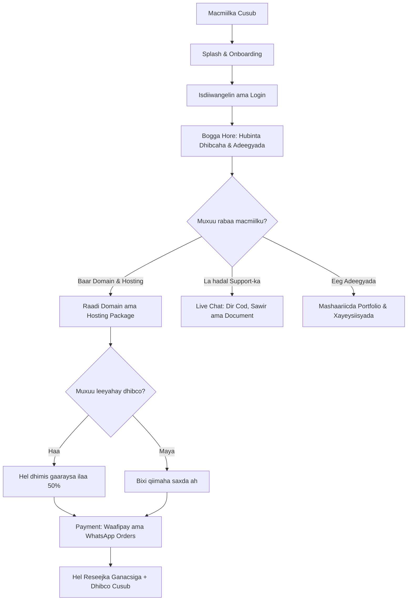

# 🦌 Deero Advert App — Buugga Rasmiga ah ee Sifooyinka & Bogagga (Official Business & Pages Documentation)

Deero Advert App waa application moobayl oo heer sare ah oo loo dhisay inuu buundo isku xir ah u noqdo macaamiisha iyo adeegyada xayaysiinta, IT-ga, naqshadaynta, iyo adeegyada internet-ka ee **Deero Advert** (oo qayb ka ah **Deero Enterprise**). App-kan wuxuu macaamiisha u sahlayaa inay si toos ah u maareeyaan mashaariicdooda, u baaraan domain-yada, u iibsadaan hosting-ka, ula xiriiraan taageerada farsamo, iyo inay ku urursadaan dhibco loyalty ah oo siinaya dhimis gaaraysa ilaa **50%**.

---

## 📌 Tusmada Bogagga & Sifooyinka (Table of Contents)
1. [🌟 Qiimaha Ganacsi ee App-ku leeyahay (Business Value)](#-qiimaha-ganacsi-ee-app-ku-leeyahay-business-value)
2. [🔄 Jaantuska Habka Macmiilka (Customer Journey Map)](#-jaantuska-habka-macmiilka-customer-journey-map)
3. [📁 Hagaha Bogagga App-ka (Detailed Page Directory)](#-hagaha-bogagga-app-ka-detailed-page-directory)
   - [A. Bogagga Bilowga (Onboarding & Splash)](#a-bogagga-bilowga-onboarding--splash)
   - [B. Amniga & Gelitaanka (Authentication)](#b-amniga--gelitaanka-authentication)
   - [C. Bogga Hore & Wareegga (Home & Navigation)](#c-bogga-hore--wareegga-home--navigation)
   - [D. Domain-yada & Hosting-ka (Services & Billing)](#d-domain-yada--hosting-ka-services--billing)
   - [E. Wadahadalka & Caawinaadda (Support & Live Chat)](#e-wadahadalka--caawinaadda-support--live-chat)
   - [F. Adeegyada & Portfolio-ga (Showcase & Gallery)](#f-adeegyada--portfolio-ga-showcase--gallery)
   - [G. Macluumaadka Macmiilka & Taariikhda (Profile & History)](#g-macluumaadka-macmiilka--taariikhda-profile--history)
   - [H. Wararka, Shaqooyinka & Shuruucda (Company Info & Legal)](#h-wararka-shaqooyinka--shuruucda-company-info--legal)
4. [💳 Lacag Bixinta & Reseejyada (Payments & Receipts)](#-lacag-bixinta--reseejyada-payments--receipts)

---

## 🌟 Qiimaha Ganacsi ee App-ku leeyahay (Business Value)

* **Loyalty & Retention (Daacadnimada)**: Nidaamka dhibcaha abaalmarinta (Bonus points) wuxuu macaamiisha ku dhiirigeliyaa inay app-ka ka dhex adeegsadaan si ay u helaan dhimis 50% ah.
* **Instant Conversions (Iibsasho Degdeg ah)**: Nidaamka raadinta domain-yada oo toos ugu xiran Waafipay wuxuu kordhiyaa iibka (sales conversions).
* **Frictionless Support (Taageero Fudud)**: Wada-hadalka tooska ah ee live chat-ka oo taageeraya codka iyo sawirrada wuxuu dedejiyaa xallinta cabashooyinka macaamiisha.
* **Direct Marketing (Suuq-geyn Toos ah)**: Isticmaalka ogeysiisyada (Push Notifications) ee telefoonka macmiilka lagu tuso si loogu bandhigo adeegyo cusub.

---

## 🔄 Jaantuska Habka Macmiilka (Customer Journey Map)

---

## 📁 Hagaha Bogagga App-ka (Detailed Page Directory)

App-ku wuxuu ka kooban yahay **29 bog** oo si xirfad leh loo naqshadeeyay, kuwaas oo loo kala qaybiyay sidan soo socota:

### A. Bogagga Bilowga (Onboarding & Splash)

1. **Splash Page (`splash_page.dart`)**:
   * **Ujeeddada**: Bogga ugu horreeya ee furma marka app-ka la rido. Wuxuu soo bandhigaa astaanta (Branding) iyo animations-ka Deero Advert si loo dhiso kalsooni iyo aqoonsi.
2. **Onboarding Page (`advert_onboarding_page.dart`)**:
   * **Ujeeddada**: Boggan wuxuu macmiilka cusub u sharxaa adeegyada ugu muhiimsan ee app-ka (Domain, Hosting, Graphic Design) isagoo isticmaalaya sawirro iyo qoraallo soo jiidasho leh.
3. **Introduction Page (`advert_introduction_page.dart`)**:
   * **Ujeeddada**: Waa bogga hordhaca ah ee u dambeeya ka hor inta aan la gelin app-ka, kaas oo macmiilka u fududeeya inuu u gudbo diiwangelinta ama login-ka.

### B. Amniga & Gelitaanka (Authentication)

4. **Login Page (`login_page.dart`)**:
   * **Ujeeddada**: Bogga soo gelitaanka macaamiisha horey u lahaa akoonada, kaas oo taageera xaqiijinta amniga emailka iyo password-ka.
5. **Register Page (`register_page.dart`)**:
   * **Ujeeddada**: Bogga diiwangelinta macaamiisha cusub si ay u samaystaan akoon rasmi ah oo ay dhibcaha ku urursan karaan.
6. **Forgot Password Page (`forgot_password_page.dart`)**:
   * **Ujeeddada**: Hab fudud oo macmiilku dib ugu soo ceshan karo password-kiisa haddii uu ilaawo, isagoo ku helaya email xaqiijin ah.

### C. Bogga Hore & Wareegga (Home & Navigation)

7. **Main Navigation Page (`advert_navigationpage.dart`)**:
   * **Ujeeddada**: Nidaamka wareega ee guud (Tab Bar & Drawer Navigation). Wuxuu isku xiraa boggaga ugu muhiimsan si macmiilku ugu dhex wareego isagoo aan app-ka ka bixin.
8. **Homepage (`advert_homepage.dart`)**:
   * **Ujeeddada**: Waa wadnaha app-ka. Waxaa ku yaala:
     * **Bonus Progress Card**: Tusaya dhibcaha macmiilka iyo inta u dhiman si uu dhimis u helo.
     * **Domain Search Bar**: Raadinta domain degdeg ah.
     * **Adeegyada shirkadda (Our Services)** iyo sliders-ka xayaysiisyada.
     * **Portfolio slider** iyo macaamiishii hore u guulaystay (Major Clients).

### D. Domain-yada & Hosting-ka (Services & Billing)

9. **Domain Search Page (`advert_domains_page.dart`)**:
   * **Ujeeddada**: Bogga lagu arko natiijada baaritaanka domain-yada. Wuxuu tusayaa in domain-ku furan yahay iyo qiimihiisa. Waxaa ku dhex jira nidaamka xisaabinta dhimista (Flex/Bonus discount calculator) iyo badamada lacag-bixinta.
10. **Hosting Packages Page (`advert_hostingpage.dart`)**:
    * **Ujeeddada**: Liiska xirmooyinka hosting-ka (tusaale, Shared Hosting, VPS, Cloud). Macmiilku wuxuu ka dooran karaa billing-ka Bishii ama Sannadkii, isagoo si toos ah u dalban kara.

### E. Wadahadalka & Caawinaadda (Support & Live Chat)

11. **Chat List Page (`advert_chat_list_page.dart`)**:
    * **Ujeeddada**: Shaashadda tusaysa liiska wada-sheekaysiga ee macmiilka iyo kooxda support-ka ee shirkadda.
12. **Live Conversation Page (`advert_chatpage.dart`)**:
    * **Ujeeddada**: Shaashadda wada-hadalka tooska ah ee la isugu diro fariimaha. Waxay taageertaa:
      * Qoraal iyo mareegaha (links).
      * Duubista Codka (Voice Note) iyo dhageysigeeda ka hor intaan la dirin.
      * Dirista Sawirro, Muuqaallo (Videos), iyo Dukumiintiyo (PDF/Files).
      * Labada sax ee buluugga ah (Read Receipts) marka fariinta la akhriyo.
13. **Users List Page (`advert_users_list_page.dart`)**:
    * **Ujeeddada**: Liiska wakiilada farsamada iyo dadka kale ee macaamiishu la xiriiri karaan.
14. **Help Center & FAQ Page (`advert_helpcenter_page.dart`)**:
    * **Ujeeddada**: Xarunta caawinaadda ee ay ku jiraan su'aalaha ugu badan ee ay macaamiishu is-weydiiyaan iyo jawaabahooda si macmiilku u helo caawimo degdeg ah.

### F. Adeegyada & Portfolio-ga (Showcase & Gallery)

15. **Services Overview Page (`advert_servicepage.dart`)**:
    * **Ujeeddada**: Sharraxaad faahfaahsan oo ku saabsan dhammaan adeegyada Deero Advert sida mareegaha, naqshadaynta, iyo suuq-geynta.
16. **Portfolio Gallery Page (`advert_portfoliopage.dart`)**:
    * **Ujeeddada**: Galeri qurxoon oo lagu soo bandhigo dhammaan mashaariicdii hore ee ay shirkaddu u qabatay macaamiisha kale.
17. **Project Details Page (`advert_project_details.dart`)**:
    * **Ujeeddada**: Bogga sharxaya faahfaahinta mashruuc gaar ah, oo ay ku jiraan hadafkii mashruuca, tignoolajiyada la isticmaalay, iyo sawirrada shaqada la qabtay.
18. **Video Gallery Page (`advert_vediospage.dart`)**:
    * **Ujeeddada**: Maktabad fiidiyowyo ah oo ay macaamiishu ku daawan karaan muuqaallada xayaysiisyada iyo sharraxaadaha adeegyada shirkadda.

### G. Macluumaadka Macmiilka & Taariikhda (Profile & History)

19. **Profile Main Page (`advert_profilepage.dart`)**:
    * **Ujeeddada**: Bogga maamulka akoonka macmiilka, halkaas oo uu ka gali karo Settings-ka, luuqadaha, iyo taariikhda dalabaadkiisa.
20. **Profile Details Page (`advert_profile_details_page.dart`)**:
    * **Ujeeddada**: Bogga uu macmiilku ku bedeli karo macluumaadkiisa gaarka ah sida Magaca, Emailka, Telefoonka, iyo Sawirka Profile-ka.
21. **Bonus Points History Page (`advert_bonushistory_page.dart`)**:
    * **Ujeeddada**: Bog faahfaahsan oo macmiilku ku arko taariikhda dhibihii uu helay (tusaale, saaxiib ku martiqaadid app-ka) iyo meelihii uu ku kharash gareeyay.
22. **Order & Payment History Page (`advert_historypage.dart`)**:
    * **Ujeeddada**: Diiwaanka dhammaan macaamiladii (transactions) iyo iibsashadii uu macmiilku sameeyay si uu u hubiyo risiidhadiisa hore.

### H. Wararka, Shaqooyinka & Shuruucda (Company Info & Legal)

23. **News & Announcements Page (`advert_newspage.dart`)**:
    * **Ujeeddada**: Bogga wararka cusub iyo ogeysiisyada rasmiga ah ee ay shirkaddu u soo dirto macaamiisheeda.
24. **Careers Page (`advert_careerpage.dart`)**:
    * **Ujeeddada**: Bogga fursadaha shaqo ee ka bannaan shirkadda Deero Advert, halkaas oo macaamiishu si toos ah uga codsan karaan shaqo.
25. **Notifications Page (`advert_notificationpage.dart`)**:
    * **Ujeeddada**: Xarunta ogeysiisyada oo kaydisa dhammaan fariimihii push-ka ahaa ee macaamiisha loo soo diray.
26. **About Us Page (`advert_aboutpage.dart`)**:
    * **Ujeeddada**: Sharraxaad ku saabsan taariikhda Deero Advert, hadafkeeda, aragtideeda, iyo kooxda ka dambaysa shaqada shirkadda.
27. **Social Media Page (`advert_social_mediapage.dart`)**:
    * **Ujeeddada**: Isku xirka baraha bulshada ee rasmiga ah ee shirkadda sida TikTok, Instagram, Facebook, LinkedIn, iyo Behance si macaamiishu ula socdaan shaqooyinka cusub.
28. **Privacy Policy Page (`advert_privacy_page.dart`)**:
    * **Ujeeddada**: Dokumentiga asturnaanta oo macmiilka u sharxaya sida loo ilaaliyo xogtiisa gaarka ah.
29. **Terms of Service Page (`advert_terms_page.dart`)**:
    * **Ujeeddada**: Shuruudaha iyo xeerarka u yaala adeegsiga app-ka iyo adeegyada ay shirkaddu bixiso.

---

## 💳 Lacag Bixinta & Reseejyada (Payments & Receipts)

App-ku wuxuu leeyahay hab lacag-bixineed oo aad u casriyeysan oo ku habboon macaamiisha Soomaaliyeed:

1. **Online Payment (Waafipay)**: Isku-xirka tooska ah ee adeegga Waafipay wuxuu macaamiisha u sahlayaa inay ku bixiyaan lacagta EVC Plus ama Premier Wallet si ammaan ah.
2. **Dalbashada WhatsApp**: Macmiilku wuxuu kaloo dooran karaa inuu dalabka ku dhammeystiro WhatsApp si uu wadahadal toos ah ula yeesho wakiilka ganacsiga.
3. **Transaction Receipt**: Marka lacag-bixintu guulaysato, macmiilka waxaa loo tusayaa reseej ganacsi oo aad u qurxoon oo muujinaya:
   * **Adeegga la iibsaday** (Domain/Hosting/Service)
   * **Qiimihii asalka ahaa**
   * **Dhimistii loo sameeyay** (Discount Amount)
   * **Qiimaha dhabta ah ee la bixiyay** (Net Amount)
   * **Taariikhda & Waqtiga**.

---
*Deero Advert App waa aalad awood u siinaysa ganacsiga Deero Advert inuu si dhakhso ah oo casri ah ugu adeego macaamiishiisa, korna u qaado kalsoonida iyo daacadnimada macaamiisha.*
